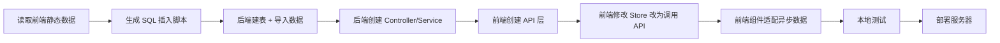

# 全面改造方案

> 本文档规划个人网站从纯静态到前后端分离架构的完整改造方案。

---

## 目录

1. [当前状态分析](#1-当前状态分析)
2. [目标架构](#2-目标架构)
3. [目录结构优化方案](#3-目录结构优化方案)
4. [后端模块规划](#4-后端模块规划)
5. [数据库设计总览](#5-数据库设计总览)
6. [前端改造策略](#6-前端改造策略)
7. [迁移执行计划](#7-迁移执行计划)
8. [文件清理建议](#8-文件清理建议)

---

## 1. 当前状态分析

### 1.1 现有页面数据状态

| 页面 | 前端数据位置 | 后端 API | 数据量 | 迁移优先级 |
|------|-------------|----------|--------|-----------|
| **Aphorism (诗词)** | `stores/aphorism/` + 后端 | ✅ 已有 | 49首诗词 | 已完成 |
| **Game (游戏)** | `stores/game/` + `api/game.ts` | ✅ 已有 | 12个游戏 | 已完成 |
| **History (历史)** | `stores/history/` + `api/history.ts` | ✅ 已有 | 100+朝代/事件/人物 | 已完成 |
| **Museum (博物馆)** | `stores/museum/` + `api/museum.ts` | ✅ 已有 | 大量博物馆数据 | 已完成 |
| **Landscape (风景)** | `stores/landscape/` + `api/landscape.ts` | ✅ 已有 | 摄影师/图片/视频/攻略 | 已完成 |
| **Music (音乐)** | `pages/Music/components/` + `stores/music/` | ✅ 已有 | 歌手/专辑/歌曲 | 已完成 |
| **TravelGuide (旅游指南)** | `stores/travelGuide/` + `api/travelGuide.ts` | ✅ 已有 | 34省/风光/美食 | 已完成 |

### 1.2 现有问题

- 数据散落在各处：`pages/*/data/`、`stores/*/data/`、组件内嵌数据
- 后端只有诗词模块，其他页面全部依赖前端静态数据
- 图片资源混用：本地 webp + OSS 远程 URL + picsum 占位图
- 缺少统一的类型定义和 API 层

---

## 2. 目标架构

### 2.1 技术栈

| 层 | 技术 | 说明 |
|----|------|------|
| 前端 | Vue 3 + TypeScript + Vite + Pinia + Element Plus | 保持不变 |
| 后端 | NestJS + TypeORM + MySQL | 保持不变 |
| 部署 | Nginx + PM2 + Ubuntu | 保持不变 |

### 2.2 架构图

```mermaid
flowchart TB
    subgraph 前端 "前端 (Vue3 SPA)"
        direction TB
        A[Pages] --> B[Store/Pinia]
        B --> C[API Layer]
        C -->|HTTP| D[Axios]
    end

    subgraph 后端 "后端 (NestJS)"
        direction TB
        D -->|/api/*| E[Controller]
        E --> F[Service]
        F --> G[TypeORM Entity]
        G -->|SQL| H[(MySQL)]
    end

    subgraph 资源 "资源层"
        I[阿里云 OSS]
        J[本地静态文件]
    end

    H -->|数据| F
    F -->|读取| I
    F -->|读取| J
```

### 2.3 API 设计原则

- 统一前缀：`/api`
- 分页：`?page=1&limit=10`
- 搜索：`?keyword=xxx`
- 分类筛选：`?category=xxx`
- 统一响应格式：`{ data, total, page, limit }`

---

## 3. 目录结构优化方案

### 3.1 后端目录（server/）

**现状**：只有 `modules/aphorism/` 一个模块，结构不清晰。

**目标结构**：

```
server/
├── src/
│   ├── modules/
│   │   ├── aphorism/          # 诗词模块（已存在）
│   │   │   ├── aphorism.controller.ts
│   │   │   ├── aphorism.service.ts
│   │   │   ├── aphorism.module.ts
│   │   │   ├── dto/
│   │   │   └── entities/      # 只放诗词相关实体
│   │   │
│   │   ├── game/              # 游戏模块（新增）
│   │   │   ├── game.controller.ts
│   │   │   ├── game.service.ts
│   │   │   ├── game.module.ts
│   │   │   ├── dto/
│   │   │   └── entities/
│   │   │
│   │   ├── history/           # 历史模块（新增）
│   │   │   ├── history.controller.ts
│   │   │   ├── history.service.ts
│   │   │   ├── history.module.ts
│   │   │   ├── dto/
│   │   │   └── entities/
│   │   │
│   │   ├── museum/            # 博物馆模块（新增）
│   │   │   ├── museum.controller.ts
│   │   │   ├── museum.service.ts
│   │   │   ├── museum.module.ts
│   │   │   ├── dto/
│   │   │   └── entities/
│   │   │
│   │   ├── landscape/         # 风景模块（新增）
│   │   │   ├── landscape.controller.ts
│   │   │   ├── landscape.service.ts
│   │   │   ├── landscape.module.ts
│   │   │   ├── dto/
│   │   │   └── entities/
│   │   │
│   │   └── music/             # 音乐模块（新增）
│   │       ├── music.controller.ts
│   │       ├── music.service.ts
│   │       ├── music.module.ts
│   │       ├── dto/
│   │       └── entities/
│   │
│   ├── common/                # 公共模块
│   │   ├── decorators/
│   │   ├── filters/
│   │   └── interceptors/
│   │
│   ├── entities/              # 全局共享实体（保留）
│   │   ├── base.entity.ts
│   │   └── index.ts
│   │
│   ├── app.module.ts
│   └── main.ts
│
├── database/
│   ├── schema/               # 建表 SQL
│   │   ├── 00-common.sql
│   │   ├── 01-aphorism.sql
│   │   ├── 02-game.sql
│   │   ├── 03-history.sql
│   │   ├── 04-museum.sql
│   │   ├── 05-landscape.sql
│   │   └── 06-music.sql
│   └── data/                 # 初始数据 SQL
│       ├── 00-common-data.sql
│       ├── 01-aphorism-data.sql
│       ├── 02-game-data.sql
│       ├── 03-history-data.sql
│       ├── 04-museum-data.sql
│       ├── 05-landscape-data.sql
│       └── 06-music-data.sql
│
└── ...
```

### 3.2 前端目录（src/）

**目标结构**：

```
src/
├── api/                      # API 请求层
│   ├── request.ts            # Axios 实例
│   ├── aphorism.ts
│   ├── game.ts               # 新增
│   ├── history.ts            # 新增
│   ├── museum.ts             # 新增
│   ├── landscape.ts          # 新增
│   └── music.ts              # 新增
│
├── types/                    # 类型定义
│   ├── index.ts              # 全局类型
│   ├── game.ts               # 游戏类型
│   ├── history.ts            # 历史类型
│   ├── museum.ts             # 博物馆类型
│   ├── landscape.ts          # 风景类型
│   └── music.ts              # 音乐类型
│
├── stores/                   # Pinia Store
│   ├── index.ts
│   ├── aphorism/
│   ├── game/                 # 精简（移除 data/）
│   ├── history/              # 新增
│   ├── museum/               # 精简（移除 data/）
│   ├── landscape/            # 精简（移除 data/）
│   └── music/                # 精简（移除 data/）
│
├── pages/                    # 页面组件
│   ├── Aphorism/             # 诗词（已完成）
│   ├── Game/                 # 游戏（迁移中）
│   ├── History/              # 历史（迁移中）
│   ├── Museum/               # 博物馆（迁移中）
│   ├── Landscape/            # 风景（迁移中）
│   └── Music/                # 音乐（迁移中）
│
├── assets/                   # 静态资源
│   ├── css/
│   ├── image/
│   └── icons/
│
├── router/
└── App.vue
```

### 3.3 部署目录结构

**目标结构**（服务器端）：

```
/var/www/personal-website/
├── dist/                    # 前端构建产物（Nginx 提供）
├── server/                  # 后端
│   ├── dist/                # NestJS 构建产物
│   └── .env
├── logs/                    # PM2 日志
├── ecosystem.config.cjs
└── nginx.conf
```

---

## 4. 后端模块规划

### 4.1 游戏模块（Game）

**API 设计**：
| 方法 | 路径 | 说明 |
|------|------|------|
| GET | `/api/games` | 获取游戏列表（支持分页、分类、标签筛选） |
| GET | `/api/games/:id` | 获取游戏详情 |
| GET | `/api/games/banners` | 获取轮播 banner |
| GET | `/api/games/categories` | 获取游戏分类列表 |

**数据表**：
- `game_categories`：游戏分类（动作、角色扮演、策略等）
- `games`：游戏基本信息
- `game_screenshots`：游戏截图
- `game_tags`：游戏标签（hot/new/sale 等）
- `game_tag_relations`：游戏-标签关联

### 4.2 历史模块（History）

**API 设计**：
| 方法 | 路径 | 说明 |
|------|------|------|
| GET | `/api/history/dynasties` | 获取朝代列表 |
| GET | `/api/history/dynasties/:id` | 获取朝代详情 |
| GET | `/api/history/events` | 获取历史事件列表 |
| GET | `/api/history/figures` | 获取历史人物列表 |
| GET | `/api/history/heritage` | 获取文化遗产列表 |

**数据表**：
- `dynasties`：朝代信息
- `historical_events`：历史事件
- `historical_figures`：历史人物
- `cultural_heritage`：文化遗产

### 4.3 博物馆模块（Museum）

**API 设计**：
| 方法 | 路径 | 说明 |
|------|------|------|
| GET | `/api/museums` | 获取博物馆列表 |
| GET | `/api/museums/:id` | 获取博物馆详情 |
| GET | `/api/exhibitions` | 获取展览列表 |
| GET | `/api/artifacts` | 获取文物列表 |

### 4.4 风景模块（Landscape）

**API 设计**：
| 方法 | 路径 | 说明 |
|------|------|------|
| GET | `/api/landscape/categories` | 获取分类（美食、风景、人物等） |
| GET | `/api/landscape/provinces` | 获取省份列表 |
| GET | `/api/landscape/guides` | 获取导游/摄影师列表 |
| GET | `/api/landscape/spots` | 获取景点列表 |

### 4.5 音乐模块（Music）

**API 设计**：
| 方法 | 路径 | 说明 |
|------|------|------|
| GET | `/api/music/artists` | 获取歌手列表 |
| GET | `/api/music/playlists` | 获取歌单列表 |
| GET | `/api/music/songs` | 获取歌曲列表 |
| GET | `/api/music/discover` | 获取推荐/发现页数据 |

---

## 5. 数据库设计总览

### 5.1 通用表

```sql
-- 分类表（通用）
CREATE TABLE categories (
  id INT AUTO_INCREMENT PRIMARY KEY,
  module VARCHAR(50) NOT NULL COMMENT '模块: game/history/museum/landscape/music',
  parent_id INT NULL,
  name VARCHAR(100) NOT NULL,
  icon VARCHAR(200),
  sort_order INT DEFAULT 0,
  created_at DATETIME DEFAULT CURRENT_TIMESTAMP,
  updated_at DATETIME ON UPDATE CURRENT_TIMESTAMP,
  INDEX idx_module (module),
  INDEX idx_parent (parent_id)
);
```

### 5.2 游戏模块表

```sql
CREATE TABLE games (
  id INT AUTO_INCREMENT PRIMARY KEY,
  title VARCHAR(200) NOT NULL,
  subtitle VARCHAR(200),
  cover_image VARCHAR(500),
  banner_image VARCHAR(500),
  category_id INT,
  price DECIMAL(10,2) DEFAULT 0,
  original_price DECIMAL(10,2),
  discount INT,
  rating DECIMAL(3,1),
  review_count INT DEFAULT 0,
  developer VARCHAR(200),
  publisher VARCHAR(200),
  release_date DATE,
  description TEXT,
  features JSON,
  platforms JSON,
  status TINYINT DEFAULT 1,
  created_at DATETIME DEFAULT CURRENT_TIMESTAMP,
  updated_at DATETIME ON UPDATE CURRENT_TIMESTAMP,
  FOREIGN KEY (category_id) REFERENCES categories(id)
);

CREATE TABLE game_screenshots (
  id INT AUTO_INCREMENT PRIMARY KEY,
  game_id INT NOT NULL,
  image_url VARCHAR(500) NOT NULL,
  sort_order INT DEFAULT 0,
  FOREIGN KEY (game_id) REFERENCES games(id) ON DELETE CASCADE
);

CREATE TABLE game_tags (
  id INT AUTO_INCREMENT PRIMARY KEY,
  name VARCHAR(50) NOT NULL,
  label VARCHAR(50),
  UNIQUE KEY uk_name (name)
);

CREATE TABLE game_tag_relations (
  game_id INT NOT NULL,
  tag_id INT NOT NULL,
  PRIMARY KEY (game_id, tag_id),
  FOREIGN KEY (game_id) REFERENCES games(id) ON DELETE CASCADE,
  FOREIGN KEY (tag_id) REFERENCES game_tags(id) ON DELETE CASCADE
);
```

### 5.3 历史模块表

```sql
CREATE TABLE dynasties (
  id INT AUTO_INCREMENT PRIMARY KEY,
  name VARCHAR(100) NOT NULL,
  period VARCHAR(100),
  era VARCHAR(50),
  is_unified TINYINT DEFAULT 0,
  description TEXT,
  highlights JSON,
  capital VARCHAR(200),
  location VARCHAR(200),
  ethnic_group VARCHAR(100),
  founder VARCHAR(100),
  map_image_url VARCHAR(500),
  map_description TEXT,
  sort_order INT DEFAULT 0,
  created_at DATETIME DEFAULT CURRENT_TIMESTAMP,
  updated_at DATETIME ON UPDATE CURRENT_TIMESTAMP
);

CREATE TABLE historical_events (
  id INT AUTO_INCREMENT PRIMARY KEY,
  title VARCHAR(200) NOT NULL,
  period VARCHAR(100),
  category VARCHAR(50),
  brief TEXT,
  description TEXT,
  impact TEXT,
  image_url VARCHAR(500),
  tags JSON,
  dynasty_id INT,
  created_at DATETIME DEFAULT CURRENT_TIMESTAMP,
  updated_at DATETIME ON UPDATE CURRENT_TIMESTAMP,
  FOREIGN KEY (dynasty_id) REFERENCES dynasties(id)
);

CREATE TABLE historical_figures (
  id INT AUTO_INCREMENT PRIMARY KEY,
  name VARCHAR(100) NOT NULL,
  title VARCHAR(100),
  dynasty_id INT,
  era VARCHAR(50),
  description TEXT,
  achievements JSON,
  image_url VARCHAR(500),
  created_at DATETIME DEFAULT CURRENT_TIMESTAMP,
  updated_at DATETIME ON UPDATE CURRENT_TIMESTAMP,
  FOREIGN KEY (dynasty_id) REFERENCES dynasties(id)
);

CREATE TABLE cultural_heritage (
  id INT AUTO_INCREMENT PRIMARY KEY,
  name VARCHAR(200) NOT NULL,
  type VARCHAR(50),
  dynasty_id INT,
  location VARCHAR(200),
  description TEXT,
  image_url VARCHAR(500),
  created_at DATETIME DEFAULT CURRENT_TIMESTAMP,
  updated_at DATETIME ON UPDATE CURRENT_TIMESTAMP,
  FOREIGN KEY (dynasty_id) REFERENCES dynasties(id)
);
```

### 5.4 博物馆、风景、音乐模块表

详见各页面迁移时的详细 SQL。

---

## 6. 前端改造策略

### 6.1 数据迁移模式

每个页面的迁移遵循同一模式：



### 6.2 Store 改造模板

**改造前**（当前）：
```typescript
// stores/game/index.ts
import { games } from './data/games';

export const useGameStore = defineStore('game', {
  state: () => ({
    games,
    banners: [...],
    categories: [...],
  }),
});
```

**改造后**（目标）：
```typescript
// stores/game/index.ts
import { fetchGames, fetchGameById, fetchBanners, fetchCategories } from '@/api/game';

export const useGameStore = defineStore('game', {
  state: () => ({
    games: [] as GameItem[],
    banners: [] as GameBanner[],
    categories: [] as GameCategoryInfo[],
    loading: false,
    error: null,
  }),
  actions: {
    async loadGames(params?) {
      this.loading = true;
      try {
        const { data } = await fetchGames(params);
        this.games = data;
      } catch (e) {
        this.error = e;
      } finally {
        this.loading = false;
      }
    },
    // ...
  },
});
```

### 6.3 保留静态的内容

以下内容保持前端静态，不需要存入数据库：

- **图标组件**（`.vue` 文件中的 SVG 图标）
- **行星背景图**（`public/App/` 下的 webp 文件）
- **UI 样式图片**（如卡片背景、按钮图片等）
- **少量演示数据**（如示例图片 URL）

---

## 7. 迁移执行计划

### 阶段划分

| 阶段 | 页面 | 预估工作量 | 复杂度 |
|------|------|-----------|--------|
| ✅ 已完成 | Aphorism (诗词) | - | - |
| ✅ 已完成 | Game (游戏) | 中 | ⭐⭐ |
| ✅ 已完成 | History (历史) | 大 | ⭐⭐⭐⭐ |
| ✅ 已完成 | Museum (博物馆) | 大 | ⭐⭐⭐ |
| ✅ 已完成 | Landscape (风景) | 中 | ⭐⭐⭐ |
| ✅ 已完成 | Music (音乐) | 大 | ⭐⭐⭐⭐ |
| ✅ 已完成 | TravelGuide (旅游指南) | 大 | ⭐⭐⭐⭐ |

### 每个阶段的交付物

1. ✅ 数据库建表 SQL（`server/database/<module>/schema/`）
2. ✅ 数据导入 SQL（`server/database/<module>/data/`）
3. ✅ 后端 NestJS 模块（`server/src/modules/`）
4. ✅ 前端 API 层（`src/api/`）
5. ✅ 前端 Store 改造（`src/stores/`）
6. ✅ 前端组件适配
7. ✅ 本地测试通过
8. ✅ 部署到服务器

---

## 8. 文件清理建议

### 8.1 可安全删除的文件

| 类型 | 位置 | 说明 |
|------|------|------|
| 部署包 | `deploy-update.tar.gz` | 重新生成 |
| 部署包 | `server-dist-update.tar.gz` | 重新生成 |
| 压缩包 | `dist.tar.gz` | 旧文件 |
| 测试 | `tests/` | 可选保留，项目未配置 CI |
| 类型声明 | `types/` | Vite 自动生成，可保留 |
| 配置 | `.env.gh-pages` | 如不再用 gh-pages 部署可删除 |

### 8.2 建议保留的文件

| 类型 | 位置 | 说明 |
|------|------|------|
| 源码 | `src/**` | 所有源码 |
| 后端 | `server/**` | 后端代码 |
| 部署 | `deploy/**` | 部署脚本和 nginx 配置 |
| 资源 | `public/App/**` | 行星背景图 |
| 资源 | `src/assets/**` | 样式和图片资源 |
| 文档 | `deploy/docs/**` | 所有文档 |
| 配置 | `.env.production` | 生产环境配置 |
| 配置 | `vite.config.ts` | Vite 配置 |
| 配置 | `vitest.config.ts` | 测试配置（保留测试能力） |

### 8.3 迁移后可删除的文件

当对应页面完成迁移后，以下静态数据文件可删除：

| 页面 | 可删除的文件 |
|------|-------------|
| Game | `src/pages/Game/data/index.ts`（已迁移，可删除） |
| History | `src/pages/History/data/*.ts`（已迁移，可删除） |
| Museum | `src/pages/Museum/data/*.ts`（已迁移，页面组件已全部改用 Store；仅保留 `data/map` 地图配置） |
| Landscape | `src/stores/landscape/data/*.ts`（迁移完成后） |
| Music | `src/stores/music/data/*.ts`（已迁移，可删除） |
| TravelGuide | `src/pages/TravelGuide/data/**`（已迁移，可删除；UI 常量已移至 `src/pages/TravelGuide/constants/scenery.ts`） |

> ⚠️ **注意**：删除前必须确认数据已成功迁移到数据库并通过后端 API 返回。

### 8.4 项目根目录清理

| 文件 | 建议 | 说明 |
|------|------|------|
| `deploy-update.tar.gz` | 🗑️ 删除 | 可重新生成 |
| `server-dist-update.tar.gz` | 🗑️ 删除 | 可重新生成 |
| `dist.tar.gz` | 🗑️ 删除 | 旧的前端压缩包 |
| `README.md` | ✅ 保留 | 项目说明 |
| `.editorconfig` | ✅ 保留 | 编辑器配置 |
| `.eslintrc.js` | ✅ 保留 | 代码规范 |
| `.gitattributes` | ✅ 保留 | Git 属性 |
| `.gitignore` | ✅ 保留 | Git 忽略 |
| `.prettierrc` | ✅ 保留 | 格式化配置 |
| `.env.gh-pages` | ⚠️ 可选删除 | 如果不再用 gh-pages |
| `.env.production` | ✅ 保留 | 生产环境配置 |

---

## 附录：迁移检查清单

每完成一个页面的迁移，需要检查：

- [ ] 后端 API 本地测试通过（Swagger / curl）
- [ ] 前端本地 `npm run dev` 测试通过
- [ ] 页面显示正常（数据从 API 加载）
- [ ] 列表/详情/搜索/筛选功能正常
- [ ] 空状态/加载状态正常
- [ ] 部署到服务器后功能正常
- [ ] 浏览器兼容性测试（Chrome/Edge）
- [ ] 移动端响应式测试

---

> **文档版本**：v1.4  
> **最后更新**：2026-08-09  
> **进度**：Aphorism ✅ | Game ✅ | History ✅ | Museum ✅ | Landscape ✅ | Music ✅ | TravelGuide ✅（全部完成）
